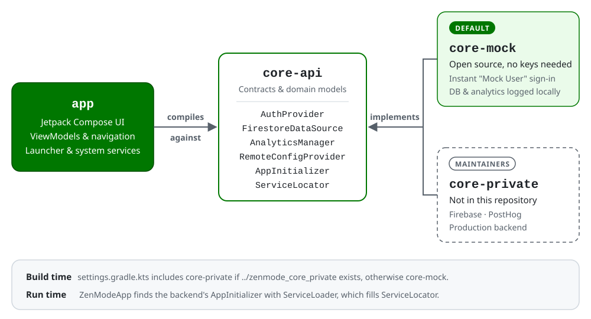
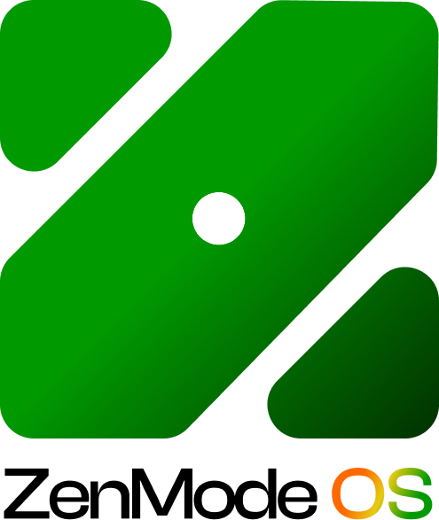

<div align="center">

<h1>ZenMode OS</h1>

<p><b>Quiet the noise, Together.</b> An Android launcher that makes intentional use easier.</p>

<a href="https://play.google.com/store/apps/details?id=com.zenlauncher.zenmode&hl=en_IN" target="_blank" rel="noopener noreferrer"></a>
&nbsp;
<a href="https://zenmodeos.com/" target="_blank" rel="noopener noreferrer"></a>
&nbsp;
<a href="mailto:helpdesk@zenmodeos.com"></a>

<br />


<br /><br />

Jump to: **[Features](#-what-you-get)** &nbsp;·&nbsp;
**[How it feels](#-a-day-in-zenmode)** &nbsp;·&nbsp;
**[Under the hood](#-under-the-hood)** &nbsp;·&nbsp;
**[Brand](#-brand--design)** &nbsp;·&nbsp;
**[Build it](#%EF%B8%8F-build-it-yourself)** &nbsp;·&nbsp;
**[FAQ](#-faq)** &nbsp;·&nbsp;
**[Support](#-say-hi)**

</div>

<br />


<br /><br />

<div align="center">

<h2>Your phone, minus the noise.</h2>

**ZenMode OS** is a free, open-source Android launcher. It turns your home screen into a calm space built around intent.<br />
It doesn't lock you out of your phone. Instead it adds a small pause at the moments you tend to lose time,<br />
and it makes keeping your screen-time promise something you do **together with friends**.

<br />

<table>
<tr>
<td align="center" width="25%"><span aria-hidden="true">🟢</span><br /><b>Zen Score</b><br />Your day, out of 10</td>
<td align="center" width="25%"><span aria-hidden="true">🔥</span><br /><b>Streaks</b><br />Promises kept, day after day</td>
<td align="center" width="25%"><span aria-hidden="true">👥</span><br /><b>ZenCircle</b><br />Accountability with friends</td>
<td align="center" width="25%"><span aria-hidden="true">🪙</span><br /><b>Gold Pay</b><br />Time saved becomes gold</td>
</tr>
</table>

<p><i>Less scrolling. More living. Less noise. More clarity.</i></p>

</div>

<p align="center"></p>

## ✨ What you get

<table>
<tr>
<td width="33%" valign="top">

### 🟢 Zen Score
A score out of 10 that sits on your home screen, so you can see how intentional your day has been at a glance.

</td>
<td width="33%" valign="top">

### 🔥 Streaks that mean something
Each day you finish above your Zen Score goal adds to your streak. Save a milestone as an image, or share it.

</td>
<td width="33%" valign="top">

### 👥 ZenCircle
Invite friends into your circle, see each other's screen time and compete on a daily leaderboard that resets every day.

</td>
</tr>
<tr>
<td width="33%" valign="top">

### 🛑 Distraction Blocker
Turn off reels and shorts with one switch. You pick which apps stay and which go quiet, and it shows you the scrolls and hours you saved.

</td>
<td width="33%" valign="top">

### 🪙 Promise to Gold
Set a weekly screen-time promise. Keep it and Gold Pay unlocks, turning the time you saved into real gold held in your name.

</td>
<td width="33%" valign="top">

### 🧘 Mindful by design
Mindful unlocks, mindful scrolling, and a session log that tags each app session as *intentional*, *entertaining* or *disrupted*.

</td>
</tr>
</table>

<p align="center">
  
</p>

<p align="center"></p>

## 🌅 A day in ZenMode

<table>
<tr>
<td align="center" width="25%" valign="top">
<b>Step 1</b><br />
<b>Make a promise</b><br />
Pick a daily screen-time limit you can actually keep, like 4 hrs/day.
</td>
<td align="center" width="25%" valign="top">
<b>Step 2</b><br />
<b>Pause, don't panic</b><br />
Opening a feed on autopilot? ZenMode adds a gentle moment of intent first.
</td>
<td align="center" width="25%" valign="top">
<b>Step 3</b><br />
<b>Keep it together</b><br />
Your ZenCircle sees the leaderboard, and friends keep friends honest.
</td>
<td align="center" width="25%" valign="top">
<b>Step 4</b><br />
<b>Get rewarded</b><br />
Streaks grow, your Zen Score climbs, and a kept week unlocks Gold Pay.
</td>
</tr>
</table>

<details>
<summary><b>📱 Regular launcher vs. ZenMode</b></summary>
<br />

| Feature | Regular launcher | **ZenMode OS** |
| :-- | :--: | :--: |
| Opens any app instantly, on autopilot | ✅ Yes | 🧘 Pauses first |
| Shows how your day is going | ❌ No | ✅ Yes, Zen Score |
| Screen-time goals you share with friends | ❌ No | ✅ Yes, ZenCircle |
| Rewards for keeping your promise | ❌ No | ✅ Yes, Streaks & Gold Pay |
| Quiets reels and shorts | ❌ No | ✅ Yes, Distraction Blocker |
| Free and open source | Varies | ✅ Yes, GPLv3 |

</details>

<p align="center"></p>

## 🌱 Our story


> In 2025, **<a href="https://github.com/Kamal007OLica" target="_blank" rel="noopener noreferrer">Kamal</a>** and **<a href="https://github.com/ThammanaSrinivas" target="_blank" rel="noopener noreferrer">Srinivas</a>** met at **India FOSS United 2025**.
>
> Today we're building **ZenMode**, a movement toward mindful technology that improves the lives of the next generation. It's free and open source, and we build it in public.

<p align="center"></p>

## 🧠 Under the hood

ZenMode uses a **modular composite build**. The open-source app and its contracts live in this repo. Proprietary backend integrations stay in a separate private module.

<p align="center">
  <picture>
    <source media="(prefers-color-scheme: dark)" srcset=".github/assets/architecture-dark.svg" />
    <source media="(prefers-color-scheme: light)" srcset=".github/assets/architecture-light.svg" />
    
  </picture>
</p>

**How it's wired**

- **Build time:** `settings.gradle.kts` includes `core-private` when `../zenmode_core_private` exists. Otherwise it includes `core-mock`, which `app` pulls in as `runtimeOnly`.
- **Run time:** `ZenModeApp` finds the backend's `AppInitializer` with `ServiceLoader`. That fills `ServiceLocator` with auth, database, analytics and remote config.

| Module | What lives there |
| :-- | :-- |
| **`app`** | The Android app: all UI, views, ViewModels and navigation, plus the launcher, accessibility and notification services. |
| **`core-api`** | The public interface layer, with the contracts for authentication, analytics and Firestore, and the domain models. |
| **`core-mock`** | A mock implementation of `core-api`, so contributors can build and test locally without private backend keys. |
| **`core-private`** | *Not in this repository.* The closed-source implementation that connects to Firebase, PostHog and other services. |

<details>
<summary><b>🔐 Why ZenMode asks for these permissions</b></summary>
<br />

| Permission | Why we need it |
| :-- | :-- |
| **Default launcher** | ZenMode *is* your home screen. |
| **Usage access** | Calculates your screen time and Zen Score, and lets ZenMode know when a distracting app is open. |
| **Accessibility service** | Used *only* to lock your screen when you tap the lock button on the home screen. It doesn't read screen content or collect data. |
| **Display over other apps** | Shows the mindful pause on top of a distracting app. |
| **Notifications** | Streak and ZenCircle updates, plus the foreground service that keeps monitoring reliable. |

</details>

<details>
<summary><b>🧰 Tech stack</b></summary>
<br />

<p>
  
  
  
  
  
</p>

**Min SDK** 28 (Android 9) &nbsp;·&nbsp; **Target SDK** 35

</details>

<p align="center"></p>

## 🎨 Brand & design

The official **ZenMode brand guide** covers the logo, colors, typography and how to use them. For anything design-related, start there.

<p align="center">
  <a href="https://zenmodeos.com/brand/" target="_blank" rel="noopener noreferrer"></a>
</p>

- **Typefaces:** Cabinet Grotesk for text and Reddit Mono for numbers. Both are bundled in `app/src/main/res/font/` and set in `ui/theme/Type.kt`.
- **App design spec:** color tokens, typography and spacing are in <a href="design_system.md" target="_blank" rel="noopener noreferrer"><code>design_system.md</code></a>.
- **Logo, colors and usage rules:** <a href="https://zenmodeos.com/brand/" target="_blank" rel="noopener noreferrer">zenmodeos.com/brand</a>

<p align="center"></p>

## 🛠️ Build it yourself

You **don't** need private backend keys. The build notices you're a contributor and switches to the mock backend automatically.

```bash
# 1. Clone
git clone https://github.com/ThammanaSrinivas/zenmode.git
cd zenmode

# 2. Open the folder in Android Studio, let Gradle sync, then hit ▶ Run
```

If `settings.gradle.kts` doesn't find a sibling `zenmode_core_private` directory, all backend calls go to **`core-mock`**:

- ✅ &nbsp;Every login succeeds immediately as a fake **"Mock User"**
- ✅ &nbsp;Firestore reads and writes are logged to the console, so you don't need a network or a Google Cloud account
- ✅ &nbsp;Analytics events are logged locally and never sent to PostHog

<p align="center"></p>

## 🤝 Contributing

We'd love your help making phones calmer for everyone.

1. **Stay in the open modules.** Only change `app`, `core-api` or `core-mock`.
2. **Add backend needs in pairs.** Define the interface in `core-api` **and** add a mock in `core-mock`, so everyone else's build keeps working.
3. **Run the checks first.** Make sure tests and lint pass before you open a Pull Request.

<a href="https://github.com/ThammanaSrinivas/zenmode/graphs/contributors" target="_blank" rel="noopener noreferrer">
  
</a>

<p align="center"></p>

## ❓ FAQ

<details>
<summary><b>Is ZenMode free?</b></summary>
<br />
Yes. ZenMode is free, and the app in this repository is open source under GPLv3.
</details>

<details>
<summary><b>Will it lock me out of my apps?</b></summary>
<br />
No. ZenMode is about <i>intent</i>, not punishment. It adds a mindful pause before distracting apps and helps you keep the promise you set, but you're always in control.
</details>

<details>
<summary><b>Can I go back to my old launcher?</b></summary>
<br />
Yes, at any time. Change your default home app in Android settings, or uninstall ZenMode.
</details>

<details>
<summary><b>I found a bug or have an idea. Where do I go?</b></summary>
<br />
<a href="https://github.com/ThammanaSrinivas/zenmode/issues" target="_blank" rel="noopener noreferrer">Open an issue on GitHub</a>, or email <a href="mailto:helpdesk@zenmodeos.com">helpdesk@zenmodeos.com</a>.
</details>

<p align="center"></p>

## 💚 Say hi

<div align="center">

Need help, have feedback, or just want to say hi? We read every message.

<table>
<tr>
<td align="center" width="50%">
<span aria-hidden="true">🛟</span><br />
<b>Helpdesk</b><br />
<a href="mailto:helpdesk@zenmodeos.com"><b>helpdesk@zenmodeos.com</b></a><br />
Support, bugs and account help
</td>
<td align="center" width="50%">
<span aria-hidden="true">🌐</span><br />
<b>Website</b><br />
<a href="https://zenmodeos.com/" target="_blank" rel="noopener noreferrer"><b>zenmodeos.com</b></a><br />
News, brand and everything ZenMode
</td>
</tr>
</table>

<br />

<a href="https://play.google.com/store/apps/details?id=com.zenlauncher.zenmode&hl=en_IN" target="_blank" rel="noopener noreferrer"></a>

<br /><br />

If ZenMode helps you, a ⭐ on this repo helps others find it.

</div>

<br />

## 📜 License

ZenMode is licensed under the **GNU General Public License v3.0**. See <a href="LICENSE" target="_blank" rel="noopener noreferrer">LICENSE</a> for details.

<br />

<div align="center">
  <picture>
    <source media="(prefers-color-scheme: dark)" srcset=".github/assets/logo-dark.png" />
    <source media="(prefers-color-scheme: light)" srcset=".github/assets/logo-light.png" />
    
  </picture>
  <br />
  <p><b>Quiet the noise, Together.</b><br />
  <a href="https://zenmodeos.com/" target="_blank" rel="noopener noreferrer">zenmodeos.com</a></p>
</div>
